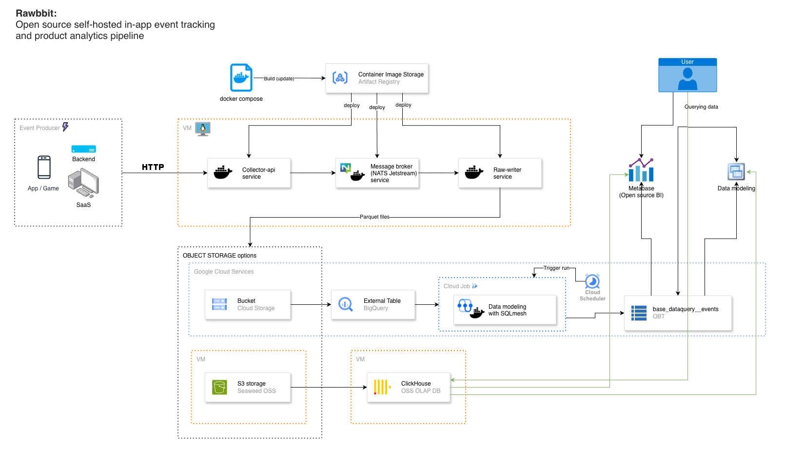

# Rawbbit

Rawbbit is a self-hosted event telemetry pipeline for mobile and web games.
It helps small teams collect player events, sessions, funnels, retention signals, economy events, monetization events, and backend game-service events while keeping ownership of the raw data.

It was created for teams that want game analytics without making a proprietary vendor the center of their telemetry stack.
The same pipeline also works for web apps, mobile apps, browser surfaces, and other event-producing products, but the OSS docs are written first for game developers operating their own stack.

Game clients, web builds, mobile apps, and backend services send batched events over HTTP.
Rawbbit validates and enriches those events in the collector, buffers them through [NATS JetStream](https://nats.io/), writes partitioned Parquet files to S3-compatible object storage such as [SeaweedFS](https://github.com/seaweedfs/seaweedfs), loads the raw layer into ClickHouse, and exposes the ClickHouse-backed data through MCP, Metabase, agents, and direct SQL access.



Main Rawbbit path:

```text
Producer -> Collector API -> NATS JetStream -> Raw Writer
  -> S3-compatible object storage / SeaweedFS Parquet
  -> ClickHouse loader cron job
  -> ClickHouse
  -> MCP / Metabase / agents / users
```

Optional BigQuery path:

```text
Producer -> Collector API -> NATS JetStream -> Raw Writer
  -> object storage Parquet
  -> BigQuery external table
  -> SQLMesh base model
```

Storage note:
- SeaweedFS/S3-compatible storage is the preferred OSS raw-storage path
- GCS remains supported
- the BigQuery external-table path remains a supported optional downstream path, not the main architecture

Production-oriented OSS deployment is split into two provider-neutral VM
guides:

- VM one runs ingestion and raw object storage: Caddy, NATS JetStream,
  collector-api, raw-writer, and SeaweedFS
- VM two runs analytics and access surfaces: ClickHouse, the Rawbbit MCP
  server, Metabase, and Postgres for Metabase state

The boundary between the VMs is the raw Parquet layer in S3-compatible object
storage.

## Table of contents

- [What is included](#what-is-included)
- [Architecture](#architecture)
- [Quickstart](#quickstart)
- [Published images](#published-images)
- [Configuration](#configuration)
- [Repository layout](#repository-layout)
- [Project status](#project-status)
- [Documentation](#documentation)
- [License](#license)

## What is included

This repository contains the public game-telemetry ingestion-to-analytics path:

- `backend/collector-api` — HTTP ingestion service for player, gameplay, product, and server events
- `backend/raw-writer` — JetStream consumer that writes partitioned Parquet files
- `backend/deploy/` — Docker Compose and environment scaffolding for local or simple self-hosted setups
- `clickhouse/` — main analytical/query path for loading and querying raw game telemetry in ClickHouse
- `mcp-server/` — Rawbbit MCP server, MCP client setup, and combined MCP + Metabase deployment guide
- AI agents and MCP clients such as Codex, OpenCode, and OpenClaw can connect to the Rawbbit MCP server endpoint for read-only analytics exploration
- `metabase/` — optional standalone Metabase deployment guide
- `sqlmesh_project/` — optional [SQLMesh](https://sqlmesh.readthedocs.io/en/stable/) project for the BigQuery external-table path

## Architecture

The system is built around a few explicit boundaries:

- game clients, web builds, mobile apps, and backend services produce event batches
- the collector accepts and validates player and gameplay events
- [NATS JetStream](https://nats.io/) separates request handling from storage writes
- the raw writer lands durable Parquet files in object storage
- raw Parquet is the system-of-record boundary for downstream telemetry work
- ClickHouse is the main analytical database and serving path for retention, funnel, session, and event analysis
- MCP, Metabase, agents, and direct SQL are consumption surfaces on top of ClickHouse
- downstream modeling can evolve without changing the ingestion contract

For the deeper architecture note, see [`docs/architecture.md`](docs/architecture.md).

## Quickstart

For the recommended provider-neutral ingestion VM deployment guide, see
[`quickstart/vm_rawbbit_one/README.md`](quickstart/vm_rawbbit_one/README.md).
It deploys Caddy, NATS JetStream, collector-api, raw-writer, and SeaweedFS with
persistent host storage.

For the matching analytics VM deployment guide, see
[`quickstart/vm_rawbbit_two/README.md`](quickstart/vm_rawbbit_two/README.md).
It deploys ClickHouse, the Rawbbit MCP server, Metabase, and Postgres for
Metabase state. It reads Parquet from the VM-one S3-compatible endpoint and
loads it into ClickHouse.

For local validation and development, keep using [`docs/quickstart.md`](docs/quickstart.md).

The shortest path to a working local setup is:

1. copy `backend/deploy/.env.example` to `backend/deploy/.env`
2. set API keys, object-storage bucket, and credentials
3. start the stack with Docker Compose
4. send a test player event to `POST /v1/events:batch`
5. verify that Parquet files land in object storage

For the full local walkthrough, see [`docs/quickstart.md`](docs/quickstart.md).

## Published images

Rawbbit publishes public service images to GHCR:

- `ghcr.io/mirlan-irokez/rawbbit-collector-api:0.1.7`
- `ghcr.io/mirlan-irokez/rawbbit-raw-writer:0.1.8`
- `ghcr.io/mirlan-irokez/rawbbit-mcp-server:0.0.2`

The same images also have `latest` tags for convenience. Prefer pinned version tags for deployments.

You can run the stack in two ways:

- build from source with Docker Compose while developing or validating local changes
- pull the public GHCR images for repeatable OSS deployments

Secrets are not baked into these images. Provide API keys, storage credentials, ClickHouse passwords, and MCP bearer tokens through private `.env` files or secret management.

## Configuration

The canonical environment-variable reference is `backend/deploy/.env.example`.

Important configuration groups:

- NATS and stream settings
- collector API limits, API keys, CORS settings, and optional GeoIP-related attribution requirements
- raw-writer batching and ACK behavior
- object-storage bucket, prefix, and credentials

For the grouped configuration guide, see [`docs/configuration.md`](docs/configuration.md).

## Repository layout

```text
backend/
  collector-api/   HTTP ingestion service
  raw-writer/      Parquet landing worker
  deploy/          Local and self-hosted runtime scaffolding
sqlmesh_project/   Optional BigQuery SQLMesh starter model
clickhouse/        Main ClickHouse query/loading path
mcp-server/        Rawbbit MCP server and optional Metabase deploy path
metabase/          Metabase OSS ver. deploy instructions
quickstart/        Provider-neutral VM deployment guides
docs/              OSS documentation
```

Component reference notes:

- [`backend/README.md`](backend/README.md)
- [`backend/collector-api/README.md`](backend/collector-api/README.md)
- [`backend/raw-writer/README.md`](backend/raw-writer/README.md)
- [`backend/deploy` runtime notes](backend/deploy/README.md)
- [`clickhouse/README.md`](clickhouse/README.md)
- [`mcp-server/README.md`](mcp-server/README.md)
- [`metabase/README.md`](metabase/README.md)

## Project status

Current maturity:

- player event ingestion path is implemented
- raw Parquet landing path is implemented
- raw storage backend selection is implemented for both GCS and S3-compatible targets
- SeaweedFS/S3-compatible storage is the preferred OSS raw-storage path
- ClickHouse loading from raw Parquet is the main analytical/query path for player telemetry
- Rawbbit MCP server can expose a read-only analytical tool surface over a configured Rawbbit ClickHouse events table
- AI agents and MCP clients can use that MCP surface without direct access to the ingestion runtime
- Metabase can be deployed separately or together with the Rawbbit MCP server package
- BigQuery external-table querying is supported as an optional path
- [SQLMesh](https://sqlmesh.readthedocs.io/en/stable/) is included as an optional starter layer for the BigQuery path

The current release is intentionally narrow: it focuses on reliable player-event ingestion, durable raw storage, ClickHouse-backed analytics, and agent/BI access on top of that serving layer.

The included [SQLMesh](https://sqlmesh.readthedocs.io/en/stable/) model is intentionally small. It reads from the BigQuery external table over the raw Parquet layer and serves as an optional BigQuery starter path rather than the central Rawbbit modeling layer.

## Documentation

- [`docs/architecture.md`](docs/architecture.md)
- [`quickstart/vm_rawbbit_one/README.md`](quickstart/vm_rawbbit_one/README.md)
- [`quickstart/vm_rawbbit_two/README.md`](quickstart/vm_rawbbit_two/README.md)
- [`docs/quickstart.md`](docs/quickstart.md)
- [`docs/configuration.md`](docs/configuration.md)
- [`clickhouse/README.md`](clickhouse/README.md)
- [`mcp-server/README.md`](mcp-server/README.md) — includes Codex, OpenCode, and OpenClaw MCP client examples
- [`metabase/README.md`](metabase/README.md)

## License

This project is released under the Apache License 2.0. See [`LICENSE`](LICENSE).

---

## Inspired by

- [awesome-data-engineering](https://github.com/igorbarinov/awesome-data-engineering) — for the broader data engineering ecosystem
